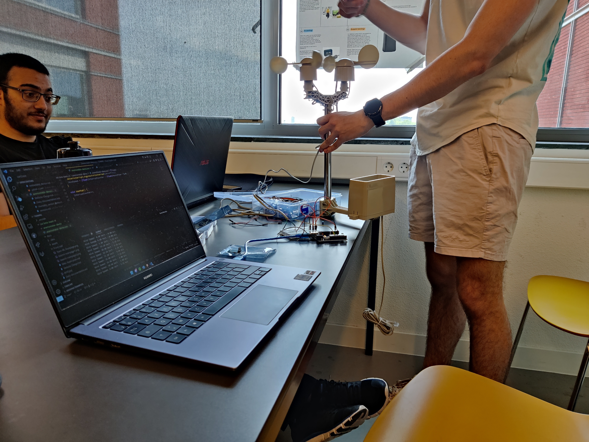

# Sensors

## Weather Station

### Wind speed (Anemometer) + direction sensor

#### Wind Speed Sensor (Anemometer)

### Humidity & Temperature Sensor

We're using a DHT22 sensor.
Here is the code we're running

```cpp
#include "DHTesp.h"
DHTesp dht;
 
void setup() {
    Serial.begin(115200);
    dht.setup(D2, DHTesp::DHT22);
}
 
void loop() {
    float h = dht.getHumidity();
    float t = dht.getTemperature();
 
    Serial.print("humidity: ");
    Serial.println(h);
    Serial.print("temp: ");
    Serial.println(t);
 
    delay(2000);
}
```

It is wired this way:  

||
| :-:|
|DHT22 Humidity and Temperature sensor|  

this is how the wiring looks in reality:  

||
| :-:|
|DHT22 Humidity and Temperature sensor|  

this is the data coming from the sensor:  

||
| :-:|
|Data coming form the DHT22 sensor|  

## Selection of sensors

### Professional option

Davis is a reputable brand that produces weather station sensors.
This is their wind speed and wind direction sensor combo. It is expensive but might be an option if we need more precise data.
It also has the benefit of working out of the box. Therefore leaving us more time to work on the rest of the features.

<center>

||
| :-:|
|[Davis 6410](https://www.davis-europe.nl/product/davis-6410-anemometer-for-vantage-pro2-vantage-pro/)|

</center>

### DIY option

This option is the cheapest one. The drawbacks are accuracy, the time it will take to build / calibrate the device, and it will not look as good as the professional option. Waterproofing is also a concern.

<center>

||
| :-:|
|Rotary sensor sketch|

</center>

#### Wind direction sensor

We would use a rotary encoder, an electronic component used mainly in knobs and dials. The idea would be
to 3D print a specific shape and put it on top of the encoder.
The wind would push the shape which would turn the "knob" until it reaches the position where
the resistance is minimal, therefore determining the direction.
Another option that we might use is a hall effect sensor. It uses the same logic as the previous methods
but this one uses a gravity field to measure the rotation of the object.

#### Wind speed sensor (Anemometer)

the idea here is to have wings on a frictionless axle.  
That way the wind will push the wings and make them rotate.  
Then we would use an IR emitter and receiver. The wings would pass in between the two.  
It would block the  signal.  
We would count the amount of interruptions of the signal and guess the speed that way.
To calibrate the sensor we would use a car. We'd get the device out of the window and measure the amount of rotations the wings do at certain speeds, that we can precisely identify using the car's speedometer.

## Chosen product and our implementation

### Weather station

||
| :-:|
|[Weahter station we chose with our customer](https://www.robotshop.com/nl/nl/sparkfun-weermeterset.html)|

| |
| :-------------------------------------------------------: |
|RJ11 pinout weahter station wind direction and speed meter|

[Arduino measure wind speed tutorial](https://www.aeq-web.com/arduino-anemometer-wind-sensor/?lang=en)

This is the schematic to connect the anemometer to a Arduino Uno

|  |
| :----------------------------------------------------------------------: |
|                   Schematic anemometer to arduino Uno                    |

We have made the windspeed sensor work!

|  |
| :--------------------------------------------------: |
|               Windspeed meter testing                |

|  |
| :-------------------------------------------------: |
|      Windspeed meter working with the terminal      |

|  |
| :---------------------------------------------------: |
|              Windspeed meter connection               |

The code we are using to control the windspeed meter

<details>
  <summary>Click to see Code!</summary>

```cpp
const int RecordTime = 3; //Define Measuring Time (Seconds)
const int SensorPin = 3;  //Define Interrupt Pin (2 or 3 @ Arduino Uno)

int InterruptCounter;
float WindSpeed;

void setup()
{
  Serial.begin(9600);
}

void loop() {
  meassure();
  Serial.print("Wind Speed: ");
  Serial.print(WindSpeed);       //Speed in km/h
  Serial.print(" km/h - ");
  Serial.print(WindSpeed / 3.6); //Speed in m/s
  Serial.println(" m/s");
}

void meassure() {
  InterruptCounter = 0;
  attachInterrupt(digitalPinToInterrupt(SensorPin), countup, RISING);
  delay(1000 * RecordTime);
  detachInterrupt(digitalPinToInterrupt(SensorPin));
  WindSpeed = (float)InterruptCounter / (float)RecordTime * 2.4;
}

void countup() {
  InterruptCounter++;
}
```

</details>

The code used for the wind direction sensor is the following:

```cpp

void loop() {
  // read the input on analog pin 0:
  int sensorValue = analogRead(A0);
  float voltage = sensorValue*5/1023.0;
  int direction = map(sensorValue, 0, 1023, 0, 360);
  Serial.print("Direction : ");
  Serial.println(direction);
  delay(300); 
}

```

This is how the sensor is wired, we're using a 10k resistor and 5V:

|  |
| :---------------------------------------: |
|         Wind vane wiring diagram          |

Then we tried to get all the sensors connected at the same time. We went outside for testing. Everything was working properly.

We're now figuring out how to get the data from the sensors to the internet. Using a wemos instead of the arduino has shown to be hard. We're facing a lot of errors.

Here is the wire scheme for reading the sensors:

|                      |
|:-------------------------------------------------------------------------:|
| Connecting schema weather station + DHT22 temperature and humidity sensor |

<details>
  <summary>Click to see Code from the weather station!</summary>

```cpp
#include "DHT.h"
#include <PubSubClient.h>
#include <ESP8266WiFi.h>
#include <DNSServer.h>
#include <ESP8266WebServer.h>
#include <ESP8266HTTPClient.h>
#include <ArduinoJson.h>

#define INTERVAL 30                                                 // Intervall of sending in seconds
// DHT
#define DHTPIN 4                                                    // DHT pin
#define DHTTYPE DHT22
//info config
//weather sensors

const byte   interruptPin = D8; // Or other pins that support an interrupt
unsigned int Debounce_Timer, Current_Event_Time, Last_Event_Time, Event_Counter;
float        WindSpeed;

const byte windSpeedPin = D8;
const byte windDirPin = A0;
// Initialize DHT sensor.
DHT dht(DHTPIN, DHTTYPE);

int status = WL_IDLE_STATUS;
unsigned int windcnt = 0;
unsigned int raincnt = 0;
unsigned long lastSend;

const char* ssid = "Ziggo_ittdesk";
const char* password = "dekey2017";

void setup_wifi() {
  // Connect WiFi
  Serial.print("Connecting to ");
  Serial.println(ssid);
  WiFi.hostname("Name");
  WiFi.begin(ssid, password);
 
  while (WiFi.status() != WL_CONNECTED) {
    delay(500);
    Serial.print("-");
    Serial.flush();
  }
  Serial.println("");
  Serial.println("WiFi connected");
 
  // Print the IP address
  Serial.print("IP address: ");
  Serial.println(WiFi.localIP());
}

//////////////// SETUP //////////////////////////////////////////////
void setup() {
  Serial.begin(115200);
  // pin for Wind speed
  pinMode(windSpeedPin, INPUT_PULLUP);
  noInterrupts();
  attachInterrupt(digitalPinToInterrupt(windSpeedPin), cntWindSpeed, RISING);
  timer0_isr_init();                             // Initialise Timer-0
  timer0_attachInterrupt(Timer_ISR);             // Goto the Timer_ISR function when an interrupt occurs
  timer0_write(ESP.getCycleCount() + 80000000L);
  pinMode(windDirPin, INPUT);
  interrupts();

  dht.begin();
  setup_wifi();
  delay(10);

  // send device attributes

  // Prepare a JSON payload string
  //     String payload = "{";
  //     payload += "\"Device\":"; payload += device_model; payload += ",";
  //     payload += "\"Firmware\":"; payload += software_version; payload += ",";
  //     payload += "\"Sensors\":"; payload += "DHT22 - Wind Speed";
  //     payload += "}";

}

//////////////// LOOP //////////////////////////////////////////////
void loop() {
  getAndSendTemperatureAndHumidityData();
  delay(1000);
}

//////////////// Functions //////////////////////////////////////////

void setup_wifi() {
  // Connect WiFi
  Serial.print("Connecting to ");
  Serial.println(ssid);
  WiFi.hostname("Name");
  WiFi.begin(ssid, password);
 
  while (WiFi.status() != WL_CONNECTED) {
    delay(500);
    Serial.print("-");
    Serial.flush();
  }
  Serial.println("");
  Serial.println("WiFi connected");
 
  // Print the IP address
  Serial.print("IP address: ");
  Serial.println(WiFi.localIP());
}

void httpPOSTRequest(const char* serverName, char* httpRequestData){
  WiFiClient client;
  HTTPClient http;
  http.useHTTP10(true);
  http.begin(client, serverName);
    // Specify content-type header
  http.addHeader("Content-Type", "application/x-www-form-urlencoded");
  // Data to send with HTTP POST
  http.addHeader("Content-Type", "application/json");
  int httpResponseCode = http.POST(httpRequestData);
  //int httpResponseCode = http.POST("{\"api_key\":\"tPmAT5Ab3j7F9\",\"sensor\":\"BME280\",\"value1\":\"24.25\",\"value2\":\"49.54\",\"value3\":\"1005.14\"}");
  
  Serial.print("HTTP Response code: ");
  Serial.println(httpResponseCode);
  http.end();
}

void getAndSendTemperatureAndHumidityData()
{
  Serial.println("Collecting Weather data.");

  // Reading temperature or humidity takes about 250 milliseconds!
  float h = dht.readHumidity();
  // Read temperature as Celsius (the default)
  float t = dht.readTemperature();

  // Check if any reads failed and exit early (to try again).
  if (false) {
    Serial.println("Failed to read from DHT sensor!");
    delay(1000);
    lastSend = millis() - INTERVAL * 1000;
    return;
  }

  //Calculate Wind Speed (klicks/interval * 2,4 kmh)
  float ws = WindSpeed;
  windcnt = 0;
  //Calculate Rain
  float r = (raincnt / 2) * 0.2794;
  raincnt = 0;
  // get wind direction
  float dirpin = analogRead(windDirPin) * (3.3 / 1023.0);
  String wd = "other";

  if (dirpin > 2.60 &&  dirpin < 2.70 ) {
    wd = "N";
  }
  if (dirpin > 1.60 &&  dirpin < 1.70 ) {
    wd = "NE";
  }
  if (dirpin > 0.30 &&  dirpin < 0.40 ) {
    wd = "E";
  }
  if (dirpin > 0.60 &&  dirpin < 0.70 ) {
    wd = "SE";
  }
  if (dirpin > 0.96 &&  dirpin < 1.06 ) {
    wd = "S";
  }
  if (dirpin > 2.10 &&  dirpin < 2.20 ) {
    wd = "SW";
  }
  if (dirpin > 3.15 &&  dirpin < 3.25 ) {
    wd = "W";
  }
  if (dirpin > 2.95 &&  dirpin < 3.05 ) {
    wd = "NW";
  }

  Serial.print("Humidity: ");
  Serial.print(h);
  Serial.print(" %\t");
  Serial.print("Temperature: ");
  Serial.print(t);
  Serial.print(" *C ");
  Serial.print("Windspeed: ");
  Serial.print(ws);
  Serial.print(" km/h ");
  Serial.print("Wind Direction: ");
  Serial.print(wd);
  Serial.print(" ");
  Serial.print("Rain: ");
  Serial.print(r);
  Serial.print(" mm ");


  String temperature = String(t);
  String humidity = String(h);
  String windspeed = String(ws);
  String winddir = String(wd);
  String rain = String(r);

  // Just debug messages
  Serial.print( "Sending Data : [" );
  Serial.print( temperature ); Serial.print( "," );
  Serial.print( humidity ); Serial.print( "," );
  Serial.print( windspeed ); Serial.print( "," );
  Serial.print( winddir ); Serial.print( "," );
  Serial.print( rain );
  Serial.print( "]   -> " );

  // Prepare a JSON payload string
  String payload = "{recordedTime: 0999-12-31T23:00:00.000:00";

  payload += "\"temperature\":"; payload += temperature; payload += ",";
  payload += "\"humidity\":"; payload += humidity; payload += ",";
  payload += "\"windSpeed\":"; payload += windspeed; payload += ",";
  payload += "\"windDirection\":"; payload += winddir; payload += ",";
  payload += "}";

  // Send payload
  char attributes[100];
  payload.toCharArray( attributes, 100 );
  //  client.publish( "v1/devices/me/telemetry", attributes );
  //  Serial.println( attributes );
  httpPOSTRequest(localhost:808/TrackTimeRecord/measurement/1, attributes);
  lastSend = millis();
}


ICACHE_RAM_ATTR void  cntWindSpeed(void) {
  if (!(millis() - Debounce_Timer) < 5) {
    Debounce_Timer = millis();                                        // Set debouncer to prevent false triggering
    Event_Counter++;
  }
}
void Timer_ISR (void) {                                                       // Timer reached zero, now re-load it to repeat
  timer0_write(ESP.getCycleCount() + 80000000L);                              // Reset the timer, do this first for timing accuracy
  WindSpeed = Event_Counter * 2.5 / 2;
  Event_Counter = 0;
}


void cntRain() {
  raincnt++;
}
```

</details>
