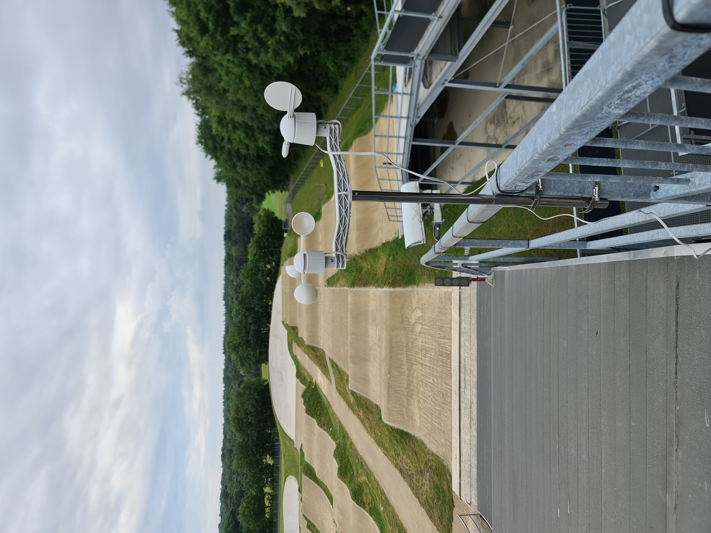

# Testing plan

## Background

As of right now, we almost completely finished the product. We made a casing, we made the sensors work and the back-end is also fully working. We want to test whether this product as a whole is fully working and if the casing is actually weatherproof.

## Hypothesis

We think casing will be weatherproof, the back-end will receive the data and the sensors will work accordingly. However, we think the front-end will causes some issues regarding showing the correct data to the user.

## The test

We will go to the location of the client and set the device up on top of the bmx ramp. When the racers use the ramp, we get data from their data system, causing our sensors to measure their data and sent that back to the back-end. The front-end will fetch this data and show it to the users of the website. Our goal is to let this run for about two hours and discuss the progress with the client, receiving feedback along the way.

## Measurements

We want to make sure it does not take too long for the data to arrive on the website, so the coaches and drivers can read it as soon as possible. That is why we are gonna measure the time between sending the data and it arriving on the website for the users to see.

## To learn

If the time between sending and receiving the data on the webpage is less than 30 seconds, the test has passed.

## To do

- Step 1: put up the sensors at the right place.
- Step 2: connect the device to a power supply.
- Step 3: Open the webpage.
- Step 4: Let the drivers start their practice.
- Step 5: Refresh the webpage and check whether data has been received.
- Step 6: repeat step 4 and 5 until we have collected 60 minutes worth of data.

## Results

We tested our product at the BMX-track. We set up the sensors at the right place.

|  |
| :-------------------------------------------------------: |
|             testing the sensors on the track              |  

After that, we tested in and checked whether it would pair with data from the drivers. The data was received by the webpage and could easily be seen. We did this for an hour, due to the data coming in succesfully and being shown on the webpage, we conclude this test as succesful.
