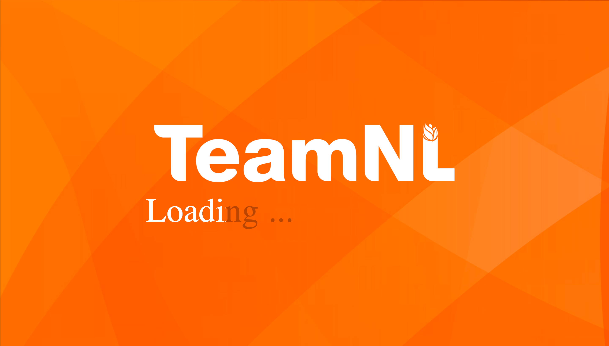
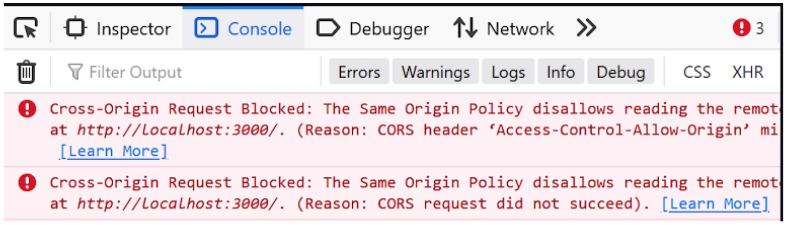

# Web Application

## Introduction

For this project there are 2 frameworks we are going to use for our web-application:

- Spring boot (back-end framework)
- Angular 6 (front-end framework)

We will also use a mysql database provided by OEGE to store data.

We will make sure the following functionalities will be implemented on the web-app:

- ability to export data into json-files
- ability for the coach and athlete to see the performance of the athlete
- ability to see improvement of the athlete and what might have affected his/her performance

## Front-end

The front-end currently looks as follows:  

||
| :---------------------------------------: |
|         Loading screen          |

||
| :---------------------------------------: |
|         Homepage          |

||
| :---------------------------------------: |
|         Profilepage          |


it gathers data from the back-end, to fill the table with data. It gather this data through this code:  

```html
<tr *ngFor="let athlete of athletes; let i= index">
        <th>{{athlete.id}}</th>
        <th>{{athlete.firstName}} {{athlete.surname}}</th>
        <th>{{athlete.trackTimeRecords[0].windSpeed}}</th>
        <th>{{athlete.trackTimeRecords[0].recordedValue}}</th>
        <th>{{athlete.trackTimeRecords[0].recordedTime}}</th>
      </tr>
```

```js
restGetAthletes(): Observable<Athlete[]>{
    return this.httpClient.get<Athlete[]>("http://localhost:80/athlete")
      .pipe(
        map(responseData => {
        const athleteArray: Athlete[] = [];
        for(const key in responseData){
          responseData[key].trackTimeRecords;
          athleteArray.push(responseData[key])
        }
        console.log("initial list", athleteArray)
        return athleteArray
      })
      );
  }
```


##### installation guide to start the web page:

1. Go to the terminal in intellij IDEA
2. in the terminal write cd bmx app
3. write in the terminal ng serve
4. press the blue link to go to the page.

## Back-end

##### Installation guide for Spring Boot:

1. Go to https://start.spring.io
2. Select which what type of project (maven or gradle) and in which code-language (java, kotlin or groovy) the package will include and what version of spring boot you want to include.
3. Select what type of package (jar or war) you want it to be exported to and which version of the code language.
4. Select dependencies if possible to be included in the package
5. Press generate

##### Setup Spring Boot in Intellij Idea:

1. Now that you have a package make sure to make a folder called **backend** inside your project folder and drop your package inside this folder
2. Right click pom.xml file and scroll down till you find the "add as maven project" option and press add.
3. At this point you should have no errors inside your backend folder, run backendApplication.java and see if it compiles
4. If it compiles you should have a 

##### Connect your oege database to the spring boot backend:

1. Edit the application.properties file
2. Copypaste the code below into the application.properties file

```xml
spring.jpa.hibernate.ddl-auto=update
spring.datasource.url=<JDBC_connection_string>
spring.datasource.username=<username>
spring.datasource.password=<password>
spring.datasource.driver-class-name =com.mysql.cj.jdbc.Driver

server.port=<can be everything, for example: 8080. This will return localhost:8080>

spring.jpa.properties.hibernate.globally_quoted_identifiers=true
spring.jpa.properties.hibernate.dialect=org.hibernate.dialect.MySQL5InnoDBDialect

```

## Deployment:

While deploying sounds hard, in actuality it isn't. Here is how we can deploy the webpage using heroku.

We also assume that you are using an angular front-end and a spring boot backend 

We used [this guide](https://gitlab.fdmci.hva.nl/se-ewa/deployment-workshop/-/blob/master/README.md), however down below will be a quick summary of this guide.

1. Create an account at [heroku](https://signup.heroku.com/login)
2. Create 2 new apps (1 for the backend and 1 for the front-end), make sure to give your domain a useful name/
3. 

## Common issues:

You will find the most common errors/issues we found developing the backend/front-end in this section.

### Front-end:

..

### Backend:

##### Cors policy error:

If you get this in your console, this means that you got a Cors policy error.


Which basically indicates that the request your trying to make does not uphold Cors security standards.

##### How to fix Cors policy error in Spring boot:

1. Create a class called WebMvcConfig
2. Paste the following code in your WebMvcConfig

```java
@Configuration
public class WebMvcConfig implements WebMvcConfigurer {
    @Override
    public void addCorsMappings(CorsRegistry corsRegistry){
        corsRegistry.addMapping("/**")
                .allowedMethods("GET","POST","PUT","DELETE")
                .allowedOriginPatterns("*")
                .allowedHeaders("*")
                .allowCredentials(true);
    }
}

```

3. Restart your backend, now you shouldn't be getting a cors policy error

##### Infinite recursion

When working on your backend and testing the different paths inside your controllers you might come across a stackoverflow error
when requesting an object which is related to another object.

This is caused by infinite recursion when jackson (which is part of Jpa) tries to serialize both sides of this relationship.
To solve this issue there are 2 primary ways of doing this:

1. Adding an @JsonIgnore in the parent of the relationship

```java
Parent.class
...
@OneToMany(mappedBy = "athlete", cascade = CascadeType.ALL, fetch = FetchType.LAZY)
@JsonIgnore
private List<TrackTimeRecord> trackTimeRecords;
```

```java
Child.class
```

2. Adding @JsonManagedReference in the parent and @JsonBackReference in the child class

```java
Parent.class
...
@OneToMany(mappedBy = "athlete", cascade = CascadeType.ALL, fetch = FetchType.LAZY)
@JsonManagedReference(value = "trackTimeRecords")
private List<TrackTimeRecord> trackTimeRecords;
```

```java
Child.class
...
@ManyToOne(targetEntity = Athlete.class, fetch = FetchType.EAGER)
@JoinColumn(name = "athlete_id")
@JsonBackReference(value = "trackTimeRecords")
private Athlete athlete;

```

##### How to make a post request with parent and child

While there are many ways to do this, I chose the easiest solution.
Which was passing the id of the athlete (in this case the foreign key) in the route.
Then using this foreign key I find the athlete related to the foreign key and then call the setter used to get tracktimerecords with their athletes

The primary reason why I did it this way is because you can't save a child without saving its entire parent in Spring Boot.

```java
Childcontroller.class
...
@PostMapping("/measurement/{athleteId}")
   public ResponseEntity<TrackTimeRecord> createTrackTimeRecord(@RequestBody TrackTimeRecord trackTimeRecord, @PathVariable int athleteId){
    
        trackTimeRecord.setAthlete(athleteRepository.findById(athleteId));
        trackTimeRecordRepository.save(trackTimeRecord);


        URI location = ServletUriComponentsBuilder
                .fromCurrentRequest()
                .path("/{id}")
                .buildAndExpand(trackTimeRecord.getId()).toUri();

        return ResponseEntity.created(location).body(trackTimeRecord);
   }
```


#### How to make a post request from the Wemos

We were constantly getting http response code -11 when trying to make a post request from the Wemos. At first we added a content length header to the request. The issue was still there so we made sure that the format of the request and the type of the variables were correct. Then we added a content type header to the request. None of those worked.
Then we changed the url we were trying to make a post request to, we turned https to http.
This fixed the issue.