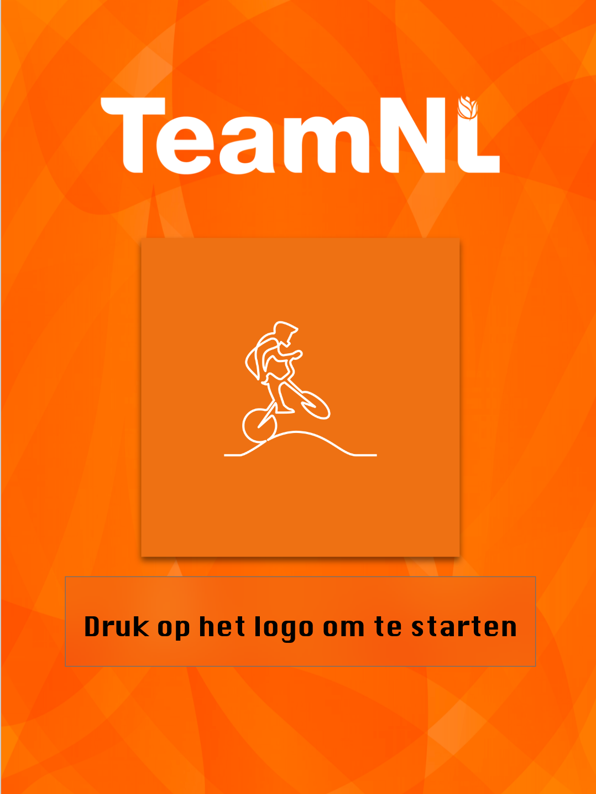
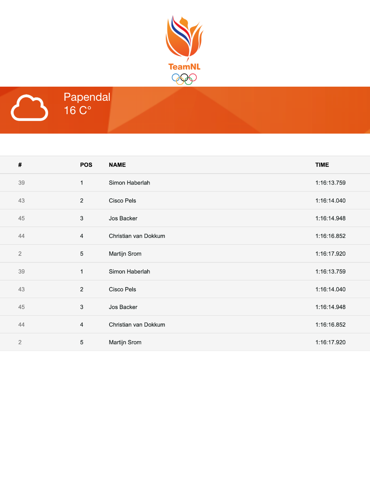
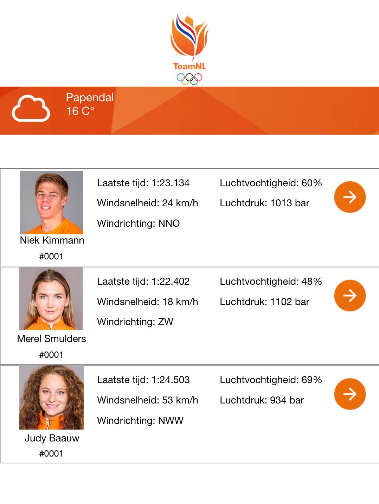
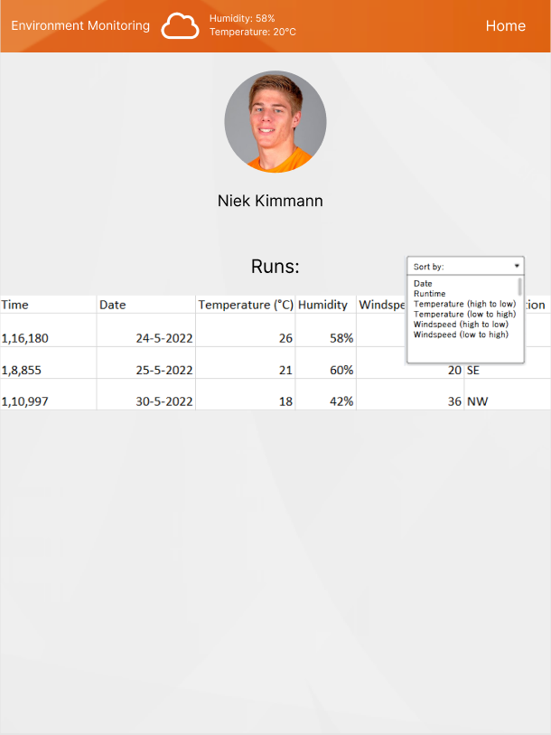
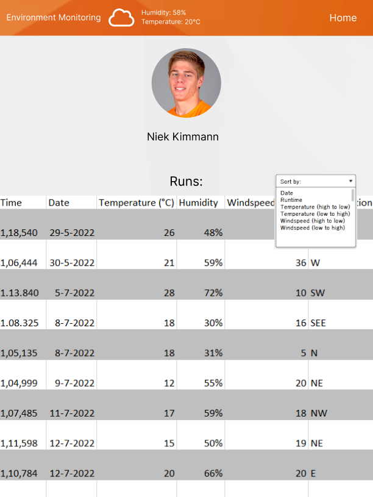

# Website Design

## Styling

Regarding styling, we are gonna use the styling used for the [public website from Team-NL](https://teamnl.org/). We received the styling for this from Team-NL themselves, thus we can easily access and use it.

## Design sketch

As we want to know how the website needs to look, before actually making the website and possibly needing to redo it all, we are making some sketches for all of the pages required for the website. Then we will show these sketches to the client and with the feedback we will make the website to the clients liking.

### Start page

This page is a loading page with a netflix-like login and is the first page the user will see, which can be used to select which coach is currently using the website. That way every coach can only access their specific drivers and do not get any useless information regarding other drivers.  

|  |
| :---------------------------------: |
|              Frontpage              |

### Main page

The Main page is the page the user will see after selecting the login. It will show the latest data send to the database, which are the latest runs done by drivers accompanied by the measurements from the sensors at those times. You can then click on these 'runs' to get to the page of the designated driver.  

|  |
| :--------------------------------: |
|             Mainpage1              |

|  |
| :--------------------------------: |
|             Mainpage2              |

### Personal page

The personal page is a page which will be made for each driver in the database. On this page you will be able to see the latest runs of the selected driver, with their latest times driven and the measurements with those times.  

|  |
| :------------------------------------------: |
|                Personal page                 |  

We made a new version of the table as the sketch previously was not clear enough, this is the result.  

|  |
| :------------------------------------------: |
|                Personal page version 2                 |
